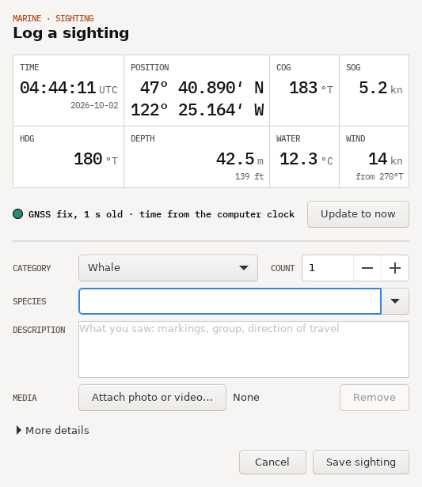
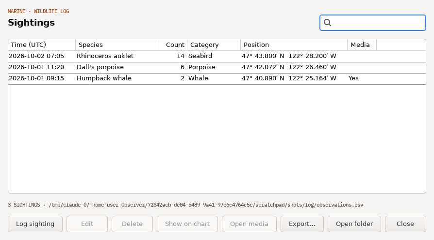

<picture>
  <source media="(prefers-color-scheme: dark)" srcset="docs/brand/sige-lockup-reversed.svg">
  
</picture>

`MARINE · OPENCPN PLUGIN`

# Observer

A wildlife sighting log for OpenCPN 5.8 and later. One click on the chart toolbar captures the time, position and instruments; you add what you saw, a short description and, if you have one, a photo or video. Each sighting is one row in a plain CSV file and one mark on the chart.



<sub>Fig. 1 — The sighting form. Everything above the rule was captured when the form opened.</sub>

## What a sighting records

Captured when you open the form:

| Field | Source | Unit |
| --- | --- | --- |
| Time | Computer clock, corrected to GNSS time from `RMC` or `ZDA` when the two disagree by 2 s or more | UTC, plus the local offset |
| Position | OpenCPN's GNSS fix (no older than 60 s), or the chart cursor for "Log sighting here" | decimal degrees, WGS 84 |
| COG, SOG, heading | OpenCPN's fix; heading is true, or magnetic plus variation | °T, kn |
| Depth | NMEA 0183 `DPT` (with its offset), else `DBS`, else `DBT` | m |
| Water temperature | NMEA 0183 `MTW` | °C |
| True wind | `MWD`, else `MWV` true or apparent, resolved against heading and SOG | kn, °T (from) |

Instrument values older than 30 s are left out rather than logged stale, and the form shows "--.-" and NO DATA for them.

Entered by you: category, species (the last 40 are remembered and autocompleted), count, description, and a photo or video. Under **More details**: behaviour, confidence, observer, a corrected position, and the bearing and range to the animal. With bearing and range, Observer computes where the animal was and puts the chart mark there.

## Install

1. Download the tarball for your system from the [latest release](https://github.com/loganrf/Observer/releases/latest).
2. In OpenCPN, open **Options › Plugins** and choose **Import plugin…**, then pick the tarball.
3. Enable **Observer** in the plugin list. A pair of binoculars appears on the toolbar.

To have OpenCPN's plugin manager offer updates, add this custom catalog in the plugin manager's catalog settings:

```
https://github.com/loganrf/Observer/releases/latest/download/ocpn-plugins.xml
```

| System | Build | Also runs on |
| --- | --- | --- |
| Debian 12, x86_64 | `debian-x86_64` 12 | Ubuntu 23.04 to 24.04 |
| Debian 13, x86_64 | `debian-x86_64` 13 | Ubuntu 26.04 |
| Debian 12, arm64 | `debian-arm64` 12 | Raspberry Pi OS 12 (64-bit) |
| Debian 13, arm64 | `debian-arm64` 13 | Raspberry Pi OS 13 (64-bit) |
| Flatpak, x86_64 and aarch64 | `flatpak-*` for the Flathub runtime | any Linux with the OpenCPN Flatpak |
| Windows, 32-bit | `msvc-wx32` | the standard OpenCPN Windows installer |
| macOS 10.13 and later | `darwin-wx32`, universal | Intel and Apple silicon |

Not built yet: Android, 32-bit Raspberry Pi OS, and the 64-bit Windows build of OpenCPN (the shared OpenCPN plugin libraries ship only a 32-bit Windows import library).

## Use

- **Toolbar**: the binoculars open the form at the boat's position.
- **Keyboard**: Ctrl+Shift+O (Cmd+Shift+O on a Mac) does the same from the chart. It replaces OpenCPN's Ctrl+O while Observer is enabled; turn it off in the preferences if you use that.
- **Chart**: right-click and choose **Log sighting here** to log at the cursor, for an animal you can place on the chart.
- **Update to now** re-reads the clock and instruments if you opened the form early.
- Enter saves from a single-line field, Ctrl+Enter from anywhere.

Right-click the chart and choose **Sightings log** to browse, search, edit or delete sightings, jump to one on the chart, open its media, or export.



<sub>Fig. 2 — The sightings log.</sub>

Exports cover the sightings shown, so a search narrows them:

- **CSV**, the same columns as the log, for spreadsheets and survey databases.
- **GeoJSON**, a point per sighting with every column as a property, for QGIS and other GIS.
- **GPX**, a waypoint per sighting that OpenCPN and most plotters import.

Preferences (OpenCPN's plugin manager, **Preferences**) set the log folder, your name and vessel, the range unit, the category and behaviour lists, whether media is copied into the log folder, and whether sightings show on the chart.

### At night

Observer follows OpenCPN's colour scheme: day draws its readouts on paper, dusk on dark grey, and night in red on black (the SIGE Helm palette) so it does not spoil dark-adapted eyes. Status uses shape as well as colour — a circle for a fresh fix, a diamond for an old fix or a cursor position, a triangle for no position — so it still reads when everything is red.

## The log

Everything lives in one folder, by default `Observer` in your documents folder:

```
Observer/
  observations.csv        one row per sighting
  observations.csv.bak    the version before the last edit or deletion
  media/                  photos and videos, named <sighting id>-<original name>
```

New sightings are appended, so a power cut costs at most the row being written. Edits and deletions rewrite the file through a temporary copy. The CSV is UTF-8 with a byte order mark, which spreadsheet programs need to read accented species names correctly.

You can edit the file by hand or in a spreadsheet. Observer never rewrites a log it could not read in full: if a row or a column is one it does not understand, the sightings log says so, new sightings are still appended, and edits and deletions are refused until the file is fixed. A file saved in the Windows "CSV" encoding is read as such and converted to UTF-8 on the next save, with the original kept as `observations.csv.before-<date>`.

Columns, in order. New columns are only ever added at the end, and Observer reads files from older and newer versions by column name:

| Column | Meaning |
| --- | --- |
| `id` | `20261002T140327Z-3f9a`: UTC time plus four random hex digits |
| `utc_time`, `local_time` | ISO 8601, e.g. `2026-10-02T14:03:27Z` and `2026-10-02T07:03:27-07:00` |
| `time_source` | `gnss` or `system` |
| `latitude`, `longitude` | vessel position, decimal degrees |
| `position_source` | `gnss`, `cursor`, `manual` or `none` |
| `fix_age_s` | age of the GNSS fix when logged |
| `cog_deg_true`, `sog_kn`, `heading_deg_true` | course, speed and heading |
| `category`, `species`, `count` | what was seen; an empty count means unknown |
| `behaviour`, `confidence` | free text; `Certain`, `Probable` or `Possible` |
| `bearing_deg_true`, `range_m` | from the vessel to the animal |
| `sighting_latitude`, `sighting_longitude` | the animal's estimated position |
| `depth_m`, `water_temp_c` | from the instruments |
| `wind_speed_kn`, `wind_dir_deg_true` | true wind, direction it blows from |
| `observer`, `vessel`, `description` | free text |
| `media` | `media/…` inside the log folder, or an absolute path if copying is off |

NMEA 2000 networks: OpenCPN passes position, course and heading to Observer from any source. Depth, water temperature and wind are read from NMEA 0183, so on an NMEA 2000-only boat they need a gateway that also outputs 0183.

## Build from source

You need CMake 3.16 or later, a C++17 compiler and wxWidgets 3.2.

```sh
git clone --recurse-submodules https://github.com/loganrf/Observer.git
cd Observer
cmake -S . -B build -DCMAKE_BUILD_TYPE=Release
cmake --build build
ctest --test-dir build --output-on-failure
cmake --build build --target tarball    # build/Observer-<version>_<target>.tar.gz
```

On Debian or Ubuntu, `apt install build-essential cmake libwxgtk3.2-dev lsb-release` covers it; `xvfb` adds the two tests that load the plugin into a stand-in OpenCPN (`tests/stub_host.cpp`). `ci/build-*.sh` are the exact builds CI runs for each platform.

The core — CSV, coordinates, NMEA parsing, the log and exports — lives in `src/core/` with no OpenCPN dependency and is unit tested in `tests/`. The OpenCPN plugin API comes from the [opencpn-libs](https://github.com/OpenCPN/opencpn-libs) submodule; Observer targets API 1.18.

## Versions and releases

Versions are calendar based: `YYYY.M.N`. `N` counts releases within the month from 0, so September 2026 runs 2026.9.0, 2026.9.1, … and October starts again at 2026.10.0. The month has no leading zero, which keeps the versions valid semantic versions that sort correctly in OpenCPN's plugin manager.

Releases are automatic. Every push to `main` that changes more than documentation runs [`release.yml`](.github/workflows/release.yml):

1. `ci/calver.sh` picks the next free number for the current UTC month from the existing `v*` tags.
2. Every platform builds and tests with that version baked in.
3. Only if all of them pass, the commit is tagged `vYYYY.M.N` and a GitHub release is published with the tarballs, their metadata, an `ocpn-plugins.xml` catalog and generated release notes.

A failed run tags nothing, so no number is skipped. Runs queue rather than overlap, so two pushes never claim the same number. To land a change without releasing it, put `[skip ci]` in the commit message. Branches and pull requests build and test the same way through [`ci.yml`](.github/workflows/ci.yml), versioned `YYYY.M.N-ci.<run>` so a test build never outranks a release.

## Licence

GPL-3.0-or-later; see [LICENSE](LICENSE). The SIGE mark and lockup in `docs/brand/` are SIGE's and are not covered by the GPL.
